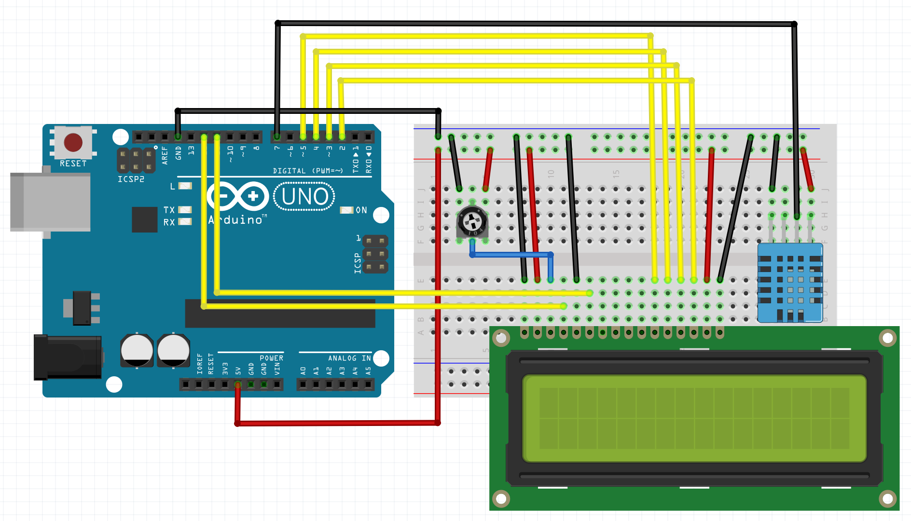
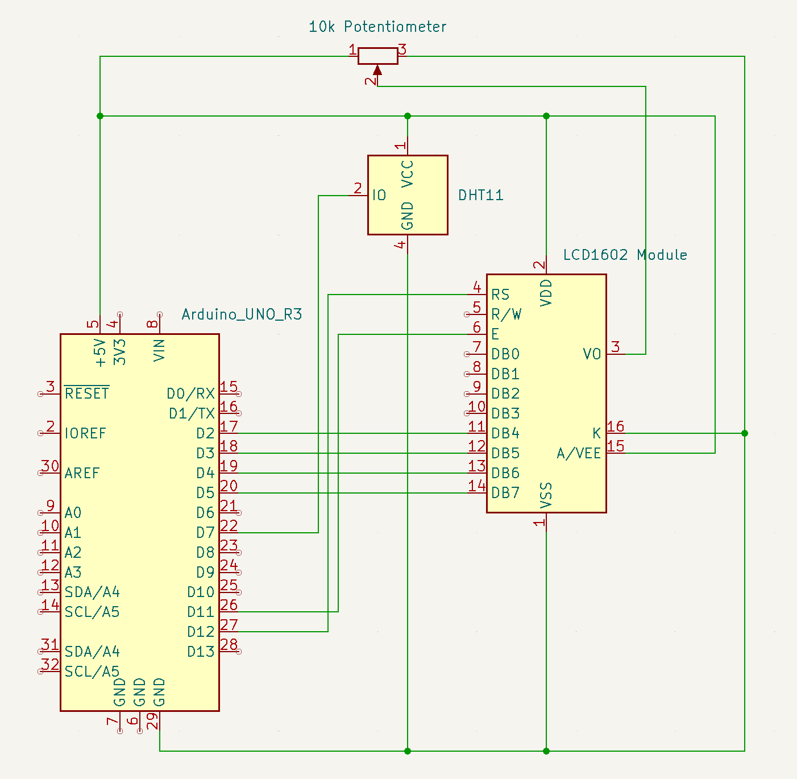

# Arduino Uno Temperature & Humidity Monitor

Simple project to monitor the temperature & humidity of the environment, using an Arduino Uno & LCD display.

> Note: this project utilises the VS Code PlatformIO plugin for project management.

## Required Parts

- Arduino Uno R3
- DHT11 temperature & humidity sensor
- LCD1602 16x2 Liquid Crystal Display module
- 10 kOhm Potentiometer

## Wiring Schematic

## PoC

## Schematic

